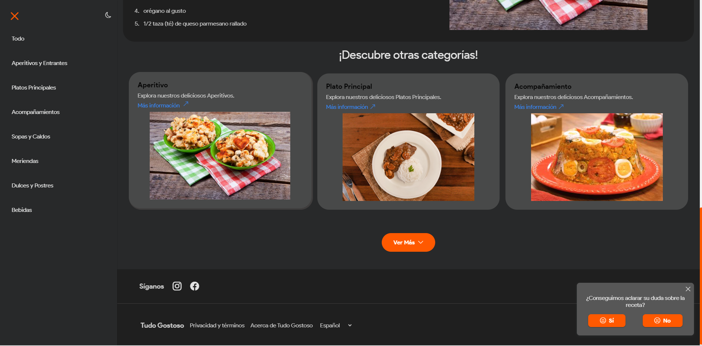

# Página de Entrada Interativa

## Visão Geral
O projeto Página de Entrada Interativa oferece uma solução completa para criar uma página de entrada moderna e funcional. Esta ferramenta interativa permite aos usuários:

- **Explorar Conteúdo:** Navegar por diversos conteúdos com uma experiência de usuário otimizada.
- **Modos Escuro e Claro:** Alternar facilmente entre modos de visualização escuro e claro para uma melhor experiência de navegação.
- **Seletor de Idiomas:** Suporte para múltiplos idiomas, incluindo Inglês, Português e Espanhol, permitindo que os usuários escolham seu idioma preferido.
- **Rolagem Suave:** Aproveitar uma rolagem suave para uma experiência de navegação mais fluida e agradável.
- **Sistema de Rotas:** Renderizar dinamicamente o conteúdo JSON por meio de um sistema de rotas eficiente e fácil de gerenciar.

Se você está procurando explorar conteúdos de forma casual ou deseja uma experiência de navegação aprimorada, este projeto oferece uma solução robusta e amigável ao usuário.

## Funcionalidades
- **Modos Escuro e Claro:** Alternar entre os modos de visualização com um simples clique.
- **Seletor de Idiomas:** Escolha entre Inglês, Português e Espanhol para visualizar o conteúdo no seu idioma preferido.
- **Rolagem Suave:** Implementação de rolagem suave para uma experiência de navegação mais agradável.
- **Sistema de Rotas:** Utiliza rotas para renderizar dinamicamente o conteúdo JSON, facilitando a atualização e o gerenciamento da página.
- **Atualizações em Tempo Real:** Exibe e atualiza o conteúdo dinamicamente em tempo real.

<a href="https://vinicius-rodriguess.github.io/Interactive-Landing-Page" target="_blank">Clique aqui para testar o projeto!</a>

# Interactive Landing Page

## Overview
The Interactive Landing Page project offers a complete solution for creating a modern and functional entry page. This interactive tool enables users to:

- **Explore Content**: Navigate through various content with an optimized user experience.
- **Dark and Light Modes**: Easily switch between dark and light viewing modes for a better navigation experience.
- **Language Selector**: Support for multiple languages, including English, Portuguese, and Spanish, allowing users to choose their preferred language.
- **Smooth Scrolling**: Enjoy smooth scrolling for a more fluid and pleasant browsing experience.
- **Routing System**: Dynamically render JSON content through an efficient and easy-to-manage routing system.

Whether you are looking to casually explore content or for an enhanced browsing experience, this project provides a robust and user-friendly solution.

## Features
- **Dark and Light Modes**: Switch between viewing modes with a simple click.
- **Language Selector**: Choose between English, Portuguese, and Spanish to view the content in your preferred language.
- **Smooth Scrolling**: Implementation of smooth scrolling for a more pleasant browsing experience.
- **Routing System**: Utilizes routes to dynamically render JSON content, making the page easy to update and manage.
- **Real-time Updates**: Dynamically displays content and updates in real-time.

<a href="https://vinicius-rodriguess.github.io/Interactive-Landing-Page" target="_blank">Click here to test the project!</a>
