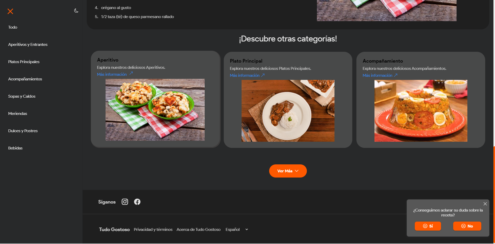

# 🔑 **Interactive Landing Page**

O projeto Página de Entrada Interativa oferece uma solução completa para criar uma página de entrada moderna e funcional. Se você está procurando explorar conteúdos de forma casual ou deseja uma experiência de navegação aprimorada, este projeto oferece uma solução robusta e amigável ao usuário.

---

## 🚀 **Funcionalidades**

- **Modos Escuro e Claro**: Alternar entre os modos de visualização com um simples clique.
- **Seletor de Idiomas**: Escolha entre Inglês, Português e Espanhol para visualizar o conteúdo no seu idioma preferido.
- **Rolagem Suave**: Implementação de rolagem suave para uma experiência de navegação mais agradável.
- **Sistema de Rotas**: Utiliza rotas para renderizar dinamicamente o conteúdo JSON, facilitando a atualização e o gerenciamento da página.
- **Atualizações em Tempo Real**: Exibe e atualiza o conteúdo dinamicamente em tempo real.

---

## 🛠️ **Tecnologias Utilizadas**

- **HTML5**: Estruturação da página e conteúdo.
- **CSS3**: Estilo e responsividade do layout.
- **JavaScript**: Lógica para gerenciamento de rotas, interação com o DOM, temas, tradução e outros recursos interativos.

---

## 🔧 **Como Executar o Projeto**

<a href="https://vinicius-rodriguess.github.io/Interactive-Landing-Page" target="_blank">Clique aqui para testar o projeto!</a>




Ou então:

1. **Clone este Repositório**:

   ```bash
   git clone https://github.com/Vinicius-Rodriguess/Interactive-Landing-Page.git
   cd interactive-landing-page
   ```

2. **Abra o arquivo** index.html **em seu navegador** para ver a página de entrada em ação.

---

## 🖥️ **Exemplo de Uso**

1. **Escolha o idioma**: Use o seletor de idiomas para visualizar o conteúdo no idioma desejado.
2. **Alternar entre modos**: Clique no botão de tema para alternar entre os modos escuro e claro.
3. **Navegue suavemente**: Utilize a rolagem suave para explorar os conteúdos com mais conforto.
4. **Explore os conteúdos dinâmicos**: Aproveite as atualizações em tempo real do conteúdo exibido.

---

## ✅ **Melhorias Futuras**

- Adicionar novos idiomas ao seletor de idiomas.
- Implementar animações mais avançadas e transições suaves entre os elementos.
- Melhorar o sistema de rotas para suportar URLs mais amigáveis.

---

## 👨‍💻 **Autor**

**Vinicius Rodrigues**

- GitHub: [Vinicius-Rodriguess](https://github.com/Vinicius-Rodriguess)
- Email: rodrigues.vini.2004@gmail.com


